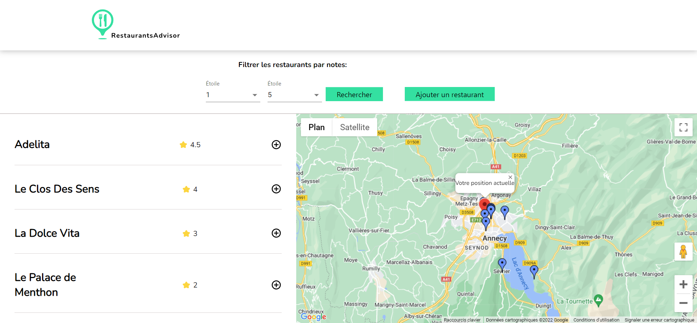
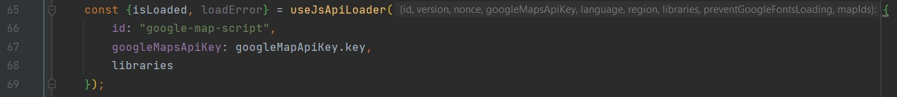

# OpenClassrooms Projet 7, Lancez votre propre site d'avis de restaurants

## Consignes

Pour ce projet, vous allez devoir apprendre à utiliser des API externes, telles que celles de Google Maps et de Google Places (votre plus gros concurrent 😉 ). Et ce n'est pas tout : vous allez devoir orchestrer toutes ces informations de manière cohérente dans votre application !



### Etape 1 : la carte des restaurants

Commencez par les fondations de votre application. Il y aura 2 sections principales :

- Une carte Google Maps, chargée avec l'API de Google Maps
- Une liste de restaurants correspondant à la zone affichée sur la carte Google Maps

Vous placerez ces éléments côte à côte.

La carte Google Maps sera centrée immédiatement sur la position de l'utilisateur. Vous utiliserez l'API de géolocalisation de JavaScript. Un marqueur de couleur spécifique sera placé à l'emplacement de l'utilisateur.

Une liste de restaurants est fournie sous forme de données JSON présentées dans un fichier à part. En temps normal, ces données vous seraient renvoyés par un backend via une API, mais pour cet exercice il sera pour le moment suffisant de charger en mémoire tous les restaurants en mémoire directement.

Affichez ces restaurants grâce à leurs coordonnées GPS sur la carte. Les restaurants qui sont actuellement visibles sur la carte doivent être affichés sous forme de liste sur le côté de la carte. Vous afficherez la moyenne des commentaires de chaque restaurant (qui va de 1 à 5 étoiles).

Lorsqu'on clique sur un restaurant, la liste des avis enregistrés s'affiche avec les commentaires. Affichez aussi la photo Google Street View grâce à l'API correspondante.

Un outil de filtre permet d'afficher uniquement les restaurants ayant entre X et Y étoiles. La mise à jour de la carte s'effectue en temps réel.

### Etape 2 : ajoutez des restaurants et des avis !

Vos visiteurs aimeraient eux aussi donner leur avis sur des restaurants !Proposez-leur :

- D'ajouter un avis sur un restaurant existant
- D'ajouter un restaurant, en cliquant sur un lieu spécifique de la carte

Une fois un avis ou un restaurant ajouté, il apparaît immédiatement sur la carte. Un nouveau marqueur apparaît pour indiquer la position du nouveau restaurant.

Les informations ne seront pas sauvegardées si on quitte la page (elles restent juste en mémoire le temps de la visite).

### Etape 3 : intégration avec l'API de Google Places

Pour l'instant, il n'y a pas beaucoup de restaurants et pas beaucoup d'avis. Heureusement, Google Places propose une API pour récupérer des restaurants et des avis. Servez-vous en pour afficher des restaurants et avis supplémentaires sur votre carte !

Vous utiliserez la search api pour trouver des restaurants dans la zone affichée.

## Démarrage du projet avec Create React App

Ce projet a été lancé avec [Create React App](https://github.com/facebook/create-react-app).

## Récupération du projet

Vous pouvez récupérer l'application en utilisant Git avec la commande ```git clone https://github.com/Boris74000/OC-Projet-7-Lancez-votre-propre-site-d-avis-de-restaurants.git```
ou en [Téléchargeant le zip](https://github.com/Boris74000/OC-Projet-7-Lancez-votre-propre-site-d-avis-de-restaurants/archive/refs/heads/master.zip). 

## Installation de l'application

- Téléchargez et installer [Node.js](https://nodejs.org/fr/download/ "download node.js").
- Vérifiez que Node.js est bien installé en exécutant dans la console ```node -v ```.
- À la racine du projet, lancez la commande ``npm install``.
- Dans le fichier src/components/Map/Map.js, à la ligne 67, remplacez "googleMapApiKey.key" par votre propre clé API google map

- Lancez la commande ```npm start```.

Ouvrez [http://localhost:3000](http://localhost:3000) pour voir l'application dans le navigateur.

La page se rechargera lorsque vous apporterez des modifications.

# Technologies

- React 17.0.2
- Material UI
- Google map API
